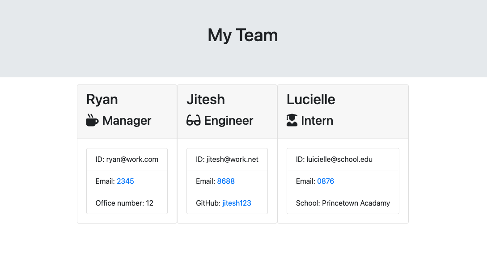
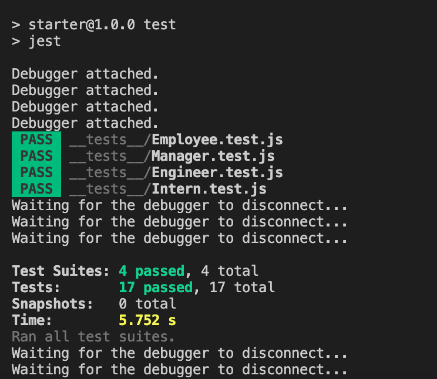

# Team-Profile-Generator-TDD
A Team Profile Generator made with test driven develpoment (TDD)

##This is a way to create a HTML with all your team members displayed and is made through Terminal

## Table Of Contents
  * [Description](#description)
  * [Requirements](#require)
  * [Usage](#usage)
  * [Contact - Me](#contact - me)
  * [Contributers](#contributors)
  * [Testing](#test)

## Description
This is a way to create a HTML with all your team members displayed and is made through Terminal

## Screenshot

## Requirements
This application requires the inquirer and jest npm's

## Usage
Node, JavaScript, Markdown and ES6.

## Contact - Me
* Name - Ryan Taylor
* Email - ryant.webdev@gmail.com
* GitHub - [RyzaT](https://github.com/RyzaT/)

## Contributors
I have used youtube, Mozilla Developer Network and W3 schools websites to help me with this project.

## Testing
A test folder is provided and runs trough jest.

## License
  License used for this project - MIT
  * For more information on license types, please reference this website
for additional licensing information - [https: //choosealicense.com/](https://choosealicense.com/).
  